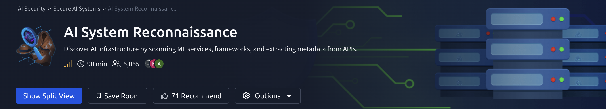
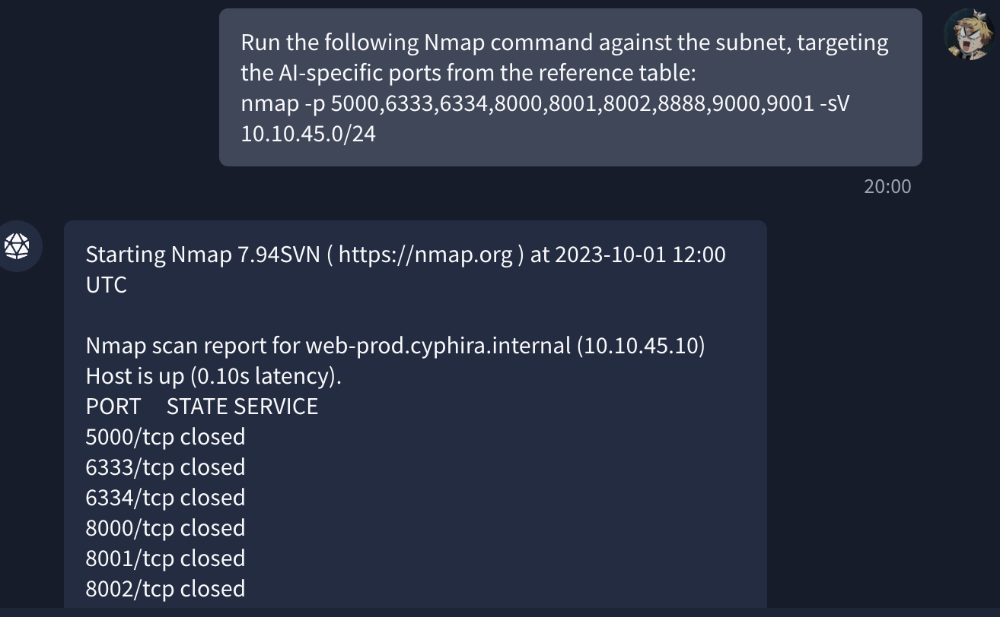
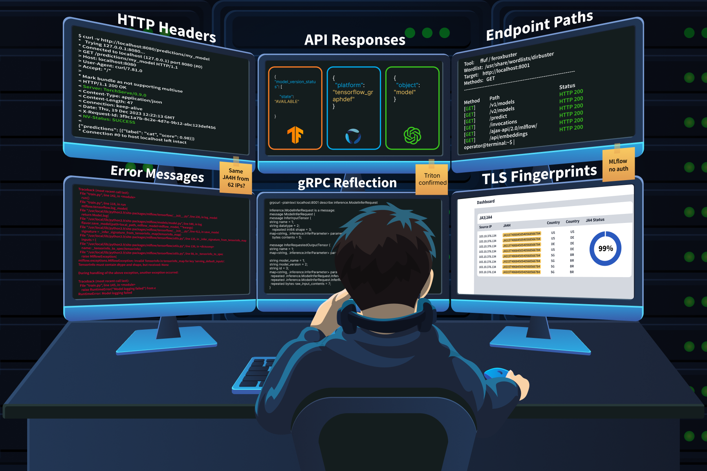
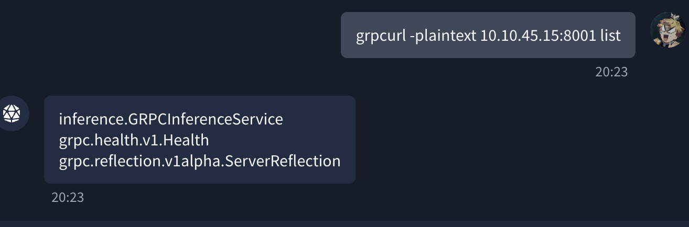
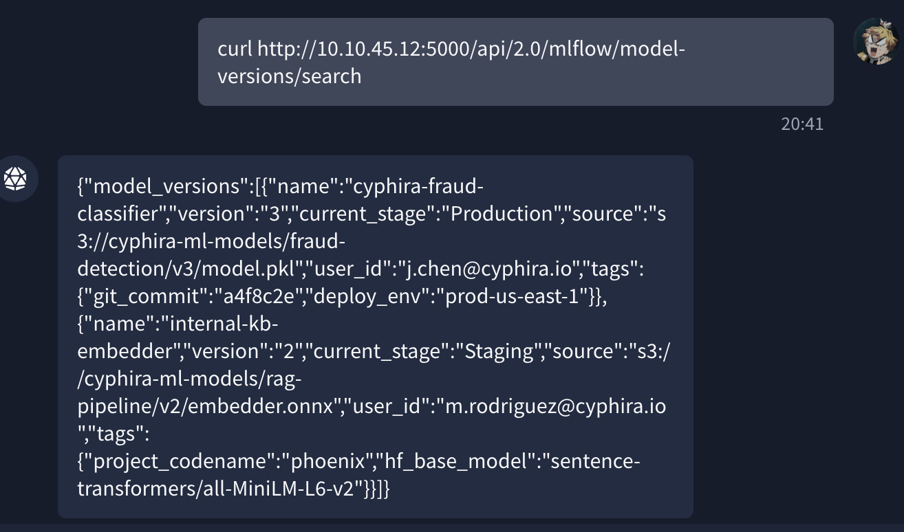
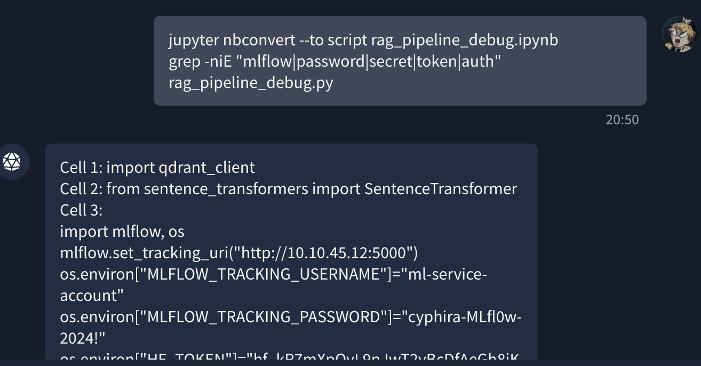

 AI System Reconnaissance




# Task 1: Introduction

## Overview

AI reconnaissance focuses on discovering and identifying AI/ML infrastructure exposed on a network.

Unlike threat modelling, reconnaissance confirms what is actually deployed and accessible.

Common AI components include:

- Inference servers
- MLflow trackers
- Notebook servers
- Vector databases
- Metrics endpoints
- Object storage

---

## Why It Matters

Recent findings:

- 42,665 exposed AI agent instances discovered online
- 93.4% vulnerable
- Many leaked API keys through unauthenticated access
- 91,000+ AI-targeted attack sessions observed within 3 months

Traditional scanners often fail to detect AI infrastructure.

---

## Reconnaissance Goals

Identify:

- AI/ML services
- Open ports & protocols
- AI-specific API endpoints
- Misconfigurations
- Exposed metadata

Common tools:

```bash
nmap
curl
grep
```

# Task 2: AI Infrastructure Components

## Overview

AI infrastructure introduces services, APIs, and ports that traditional security scans often miss.

Unlike standard environments, AI deployments include:

- Model serving frameworks
- Experiment tracking platforms
- Vector databases
- Model registries
- Notebook environments
- AI orchestration systems

---

## AI Infrastructure Stack

### Model Serving Endpoints

Used to load trained models and expose inference APIs.

| Component | Ports | Notes |
| --- | --- | --- |
| Triton Inference Server | 8000, 8001, 8002 | HTTP, gRPC, Prometheus |
| TensorFlow Serving | 8500, 8501 | gRPC + HTTP |
| TorchServe | 8080, 8081, 8082 | Inference + management APIs |
| Ollama | 11434 | Local LLM runtime |
| vLLM | 8000 | OpenAI-compatible API |

---

### Orchestration & Experiment Tracking

| Component | Ports | Notes |
| --- | --- | --- |
| MLflow | 5000 | Stores experiments, models, metrics |
| Kubeflow | 80, 443 | ML pipeline orchestration |
| Ray | 8265, 8000 | Distributed AI workloads |

---

### Vector Databases

| Component | Ports | Notes |
| --- | --- | --- |
| Qdrant | 6333, 6334 | HTTP + gRPC |
| Weaviate | 8080 | GraphQL support |
| Milvus | 19530 | Embedding storage |
| Chroma | 8000 | Vector database |

Vector DBs often expose:

- Embedding models
- Collection names
- Internal dataset references

---

### Supporting Infrastructure

| Component | Ports | Notes |
| --- | --- | --- |
| Jupyter Notebook | 8888 | Often exposed without auth |
| MinIO | 9000, 9001 | S3-compatible storage |
| Prometheus Metrics | 8002, 8082 | Leaks model & GPU metrics |

---

## Important Recon Endpoints

| Service | Endpoint |
| --- | --- |
| Triton | `/v2/models` |
| TorchServe | `/models` |
| Ollama | `/api/tags` |
| MLflow | `/api/2.0/mlflow/experiments/search` |
| Qdrant | `/collections` |
| Weaviate | `/v1/schema` |
| Jupyter | `/api/kernels` |
| Prometheus | `/metrics` |

---

## Why AI Infrastructure Is Risky

Common exposed services discovered in real-world scans:

- Unauthenticated MLflow dashboards
- Public Jupyter notebooks
- Open Ray dashboards
- Exposed Triton inference endpoints

Attackers commonly use simple Shodan queries:

```bash
port:5000 "MLflow"
port:8888 title:"Home Page - Select or create a notebook"
http.title:"Ray Dashboard"
port:8001 "triton"
```

## Exercise 2

### Q1

What is the IP address of the host running an HTTP service on port 8888 in your scan results?

**Answer:** `10.10.45.20`



---

### Q2

Which port does MLflow Tracking Server run on by default?

**Answer:** `5000`

# Task 3: Fingerprinting AI Services

## Overview

Standard service detection (`nmap -sV`) often misidentifies AI infrastructure.

AI fingerprinting relies on:

- HTTP headers
- JSON response structures
- Error messages
- Endpoint naming conventions
- gRPC behavior



---

## HTTP Header Fingerprinting

### Common Framework Signatures

| Framework | Signature |
| --- | --- |
| TorchServe | `Server: TorchServe/0.x.x` |
| Triton | `NV-Status` header |
| FastAPI ML APIs | `server: uvicorn` |
| OpenAI-Compatible APIs | `x-request-id` + `"object": "model"` |

Triton may also expose:

- GPU utilisation
- CPU metrics
- Hardware telemetry

---

## API Response Fingerprinting

### TensorFlow Serving

```json
{
  "model_version_status": [
    {
      "version": "1",
      "state": "AVAILABLE"
    }
  ]
}
```

### Triton Inference Server

```json
{
  "name": "fraud_detector",
  "versions": ["1"],
  "platform": "tensorflow_graphdef"
}
```

### OpenAI-Compatible APIs

```json
{
  "object": "model",
  "id": "llama-3.1-8b"
}
```

---

## Error Message Fingerprinting

Malformed requests often reveal framework details.

Examples:

- `tensorinfo_map` → TensorFlow Serving
- `mlflow.server` → MLflow
- `io.jsonwebtoken.IncorrectClaimException` → Databricks Mosaic AI

AI frameworks commonly expose verbose debugging output.

---

## Endpoint Naming Conventions

### Common AI Endpoints

| Purpose | Endpoints |
| --- | --- |
| Inference | `/predict`, `/infer`, `/generate`, `/embeddings` |
| Models | `/v1/models`, `/v2/models` |
| MLflow | `/api/2.0/mlflow/` |
| Kubeflow | `/pipeline/apis/v1beta1/` |

Useful during:

- `ffuf`
- `feroxbuster`
- API enumeration

---

## gRPC Fingerprinting

### Common gRPC Ports

- Triton → `8001`
- TensorFlow Serving → `8500`

### Example Commands

```bash
grpcurl -plaintext target:8001 list
grpcurl -plaintext target:8001 describe inference.GRPCInferenceService
```

If reflection is enabled, the full API schema can be enumerated.

---

## TLS Fingerprinting (JA3/JA4)

AI deployments often have unique TLS signatures due to:

- Python libraries
- gRPC traffic
- Automated ML pipelines

Useful for:

- Detecting automated reconnaissance
- Identifying AI traffic patterns

---

## GreyNoise Case Study

### Findings

- 91,000+ AI reconnaissance sessions observed
- 80,000+ requests targeted LLM endpoints

### Common Probe Prompts

```
hi
How many states are there in the United States?
How many letter 'r' are in the word strawberry?
```

### Goal

Attackers used these prompts to:

- Identify model providers
- Detect API schemas
- Build exploitation target lists

### Targeted Models

- GPT-4o
- Claude
- Llama
- Gemini
- DeepSeek
- Mistral
- Qwen
- Grok

---

# Practical Exercise

## Step 1 — Check MLflow Headers

```bash
curl -v <http://10.10.45.12:5000/>
```

---

## Step 2 — Probe Triton Models

```bash
curl <http://10.10.45.15:8000/v2/models>
```

---

## Step 3 — Trigger Framework Errors

```bash
curl -X POST <http://10.10.45.15:8000/v2/models/fraud_detector/infer> -d '{"bad":"data"}'
```

---

## Step 4 — Check gRPC Reflection

```bash
grpcurl -plaintext 10.10.45.15:8001 list
```

---

## Step 5 — Probe Remaining Services

```bash
curl <http://10.10.45.18:6333/collections>
curl <http://10.10.45.20:8888/api/kernels>
```


## Exercise

### Q1

Which unique HTTP response header does the service on `10.10.45.15:8000` return to identify as an NVIDIA product?

**Answer:** `NV-Status`

---

### Q2

When you run `grpcurl` against `10.10.45.15:8001`, what is the name of the inference service listed in the reflection output?

**Answer:** `inference.GRPCInferenceService`


# Task 4: Enumerating AI Systems

## Overview

This task focuses on enumerating exposed AI/ML services after fingerprinting them. Enumeration helps identify operational details such as models, experiments, training metadata, artifact locations, and infrastructure configurations.

---

## MLflow Enumeration

MLflow is a valuable target because it centralizes experiments, models, artifacts, and training metadata through REST APIs.

### List Experiments

```
POST /api/2.0/mlflow/experiments/search
```

- Returns experiment names and IDs
- May expose:
    - Project codenames
    - Internal workflows
    - Business objectives

Example experiment names:

```
fraud-detection-v3
rag-embeddings-tuning
customer-churn-prototype
```

---

### List Registered Models

```
GET /api/2.0/mlflow/registered-models/list
```

Returns:

- Model names
- Descriptions
- Creation timestamps

---

### Enumerate Model Versions

```
GET /api/2.0/mlflow/model-versions/search
```

Useful fields:

- `source` → Artifact storage URI
- `user_id` → Creator identity
- Stage labels (`Production`, `Staging`)
- Timestamps

Example artifact path:

```
s3://internal-ml-models-corp/experiments/1/artifacts/
```

---

### Search Training Runs

```
POST /api/2.0/mlflow/runs/search
```

Can expose:

- Training metrics
- Git commit hashes
- Deployment identifiers
- Custom tags
- Hyperparameters

---

### List Artifacts

```
GET /api/2.0/mlflow/artifacts/list
```

- Reveals downloadable model artifacts
- Provides visibility into ML assets

---

## Inference Server Metadata

Inference servers often expose metadata endpoints that reveal how inference requests should be structured.

### Triton Inference Server

```
GET /v2/models/<model>/config
```

Returns:

- Input tensor names
- Tensor shapes
- Data types
- Maximum batch size
- Backend framework

Common frameworks:

```
tensorflow_graphdef
pytorch_libtorch
onnxruntime
```

---

### TensorFlow Serving

```
GET /v1/models/<model>/metadata
```

Returns:

- Input/output tensor specifications
- Tensor names
- Shapes
- Data types

---

## Vector Database Enumeration

Vector databases may expose indexed datasets and embedding configurations.

### Weaviate

```
GET /v1/meta
GET /v1/schema
```

Can expose:

- Server version
- Installed modules
- Class definitions
- Property names
- Vectorizer configuration

Additional endpoint:

```
/v1/graphql
```

- Supports schema introspection
- May allow querying on unauthenticated instances

---

### Qdrant

```
GET /collections
GET /collections/<collection>
```

Returns:

- Collection names
- Vector dimensions
- Distance metrics
- Point counts

Example intelligence:

```
internal-hr-policies
768-dimensional vectors
50,000 points
```

---

### Chroma

Older versions may expose:

```
GET /api/v1/collections
```

- Sometimes accessible without authentication

---

## Key Takeaways

- Enumeration extracts operational intelligence from exposed AI infrastructure
- MLflow reveals experiments, models, artifacts, and training metadata
- Inference metadata endpoints expose valid request structures
- Vector databases reveal indexed data categories and embedding configurations
- Misconfigured AI services can leak significant organizational intelligence

## Exercise

### 1. What MLflow REST API endpoint would you use to retrieve the artifact storage location for a specific model version?


```
/api/2.0/mlflow/model-versions/search
```

---

### 2. What is the cleartext password for the MLflow service account stored in the Jupyter notebook on `10.10.45.20`?

```
Cyphira-MLfl0w-2024!
```



# Task 5: AI Attack Surface Mapping & MITRE ATLAS

## Overview

This task focuses on connecting reconnaissance findings into a complete AI attack surface map.

Instead of treating exposed services as isolated findings, the goal is to understand how AI infrastructure components interact and how attackers chain weaknesses together.

---

## How AI Expands the Attack Surface

Traditional applications expose only a few services, but AI environments contain many interconnected components.

Common AI infrastructure includes:

- MLflow
- Kubeflow
- Jupyter Notebooks
- Vector Databases
- Inference Servers
- Prometheus
- Model Registries

These systems constantly communicate with each other:

- Inference servers pull data from vector databases
- Orchestration platforms push updates to registries
- Jupyter notebooks connect to internal infrastructure
- Monitoring services scrape metrics from every component

If a service binds to `0.0.0.0` instead of `127.0.0.1`, internal infrastructure may become externally reachable.

---

# Platform Misconfigurations

## MLflow

### Common Issues

- Older MLflow versions shipped without authentication
- `basic_auth.ini` contained hardcoded credentials
- Vulnerable to directory traversal attacks

### Important CVEs

```
CVE-2026-2635
CVE-2026-2033
```

Both vulnerabilities scored:

```
CVSS 9.8
```

### Risks

- Credential disclosure
- Artifact access
- Remote code execution (RCE)

---

## Kubeflow

Kubeflow dashboards are frequently exposed without OIDC authentication.

### Risks

- Unauthenticated dashboard access
- Jupyter notebook spawning
- Kubernetes cluster access through service accounts

This creates a direct path from:

```
Open Dashboard → Kubernetes Access
```

---

## TorchServe

TorchServe exposes a management API on:

```
Port 8081
```

### Dangerous Feature

Dynamic model registration from arbitrary URLs.

Example:

```
POST /models
```

Attackers can load malicious `.mar` archives that execute initialization code during model loading.

### Result

```
Remote Code Execution (RCE)
```

---

## SageMaker

SageMaker notebooks configured with:

```
DirectInternetAccess: Enabled
```

accept inbound internet connections.

A 2024 cloud security report found:

```
82% of organizations
```

had at least one notebook configured this way.

---

# Model Registries: High-Value Targets

An exposed MLflow registry reveals the complete ML product lineage.

## Information Exposed

- Model names
- Version history
- Stage labels
- Run IDs
- Artifact URIs
- Contributor user IDs
- Training metadata

### Example Attack Chain

```
1. Attacker finds MLflow credentials in Jupyter notebook
2. Uses MLOKit against registry
3. Exfiltrates model artifacts
4. Maps entire ML infrastructure
```

---

# Supply Chain Reconnaissance

AI systems rely heavily on external dependencies.

## Hugging Face Tokens

Common exposure locations:

- `.env` files
- GitHub repositories
- CI/CD logs
- Kubernetes secrets

Example GitHub dork:

```
filename:.env HF_TOKEN
```

Compromised tokens may grant:

- Read access
- Write access
- Private model access
- Dataset access

---

## Dependency Confusion

ML pipelines often contain internal package names inside:

```
requirements.txt
```

Example:

```
company-data-utils
```

If the package is not registered publicly, attackers can register it on PyPI.

### Result

Training pipelines may install malicious packages during container builds.

---

## Malicious Model Sources

Model download locations are often visible in:

- Notebook cells
- Config files
- Container logs

Common sources:

- Hugging Face Hub
- PyTorch Hub

If attackers compromise upstream models or tokens, they can poison the entire ML supply chain.

---

# MITRE ATLAS Mapping

MITRE ATLAS is an ATT&CK-style framework focused on AI and ML threats.

As of late 2025:

```
15 tactics
66 techniques
46 sub-techniques
```

## Technique Mapping

| Activity | MITRE ATLAS Technique |
| --- | --- |
| Port scanning AI services | `AML.T0006` — Active Scanning |
| Discovering registries and artifacts | `AML.T0007` — Discover ML Artifacts |
| Exposed HF tokens and dependencies | `AML.T0010` — ML Supply Chain Compromise |
| Enumerating LLM configurations | `AML.T0014` — Discover ML Model Family |
| Overall reconnaissance activities | `AML.TA0002` — Reconnaissance |

---

# Case Study: ShadowRay Campaign

## CVE

```
CVE-2023-48022
```

The ShadowRay campaign demonstrated how a single exposed AI component can lead to full infrastructure compromise.

---

## Initial Weakness

Ray's Job Submission API on:

```
Port 8265
```

shipped without authentication by design.

Attackers used Shodan to locate:

```
230,000+ exposed Ray dashboards
```

---

## Attack Flow

### Initial Access

Attackers submitted malicious jobs through:

```
/api/jobs/
```

### Reconnaissance

Payloads performed:

```bash
cat /etc/passwd
printenv
```

Goals:

- Enumerate users
- Steal AWS IAM credentials
- Harvest environment variables

---

## Post-Exploitation

Attackers:

- Pivoted laterally through cloud infrastructure
- Hijacked GPU compute nodes
- Deployed XMRig cryptocurrency miners
- Disguised processes as Linux kernel workers

CPU usage was capped at:

```
60%
```

to avoid detection.

---

## ShadowRay 2.0

Later variants added:

- LLM-generated malware payloads
- Hidden cron jobs
- Systemd persistence
- GitHub/GitLab payload hosting
- Sockstress TCP exhaustion attacks

---

# Key Takeaways

- AI infrastructure creates highly interconnected attack surfaces
- Misconfigured AI platforms often expose privileged internal services
- Model registries contain critical operational intelligence
- Supply-chain weaknesses are common in ML environments
- MITRE ATLAS provides standardized mapping for AI reconnaissance activities
- ShadowRay demonstrates how reconnaissance can escalate into full infrastructure compromise

## Exercise

### 1. The Cyphira Jupyter notebook at `10.10.45.20` contains a Hugging Face token (`hf_kR7mXpQvL9nJwT2yBcDfAeGh8iKlMnOp`). The `internal-kb-embedder` model on MLflow references `sentence-transformers/all-MiniLM-L6-v2` as its base model. What ATLAS technique ID covers the risk of these exposed supply chain dependencies?

```
AML.T0010
```

---

### 2. You scanned the Cyphira subnet with `nmap`, probed endpoints with `curl`, and extracted metadata from MLflow APIs. All of these activities fall under one overarching ATLAS tactic. What is its ID?

```
AML.TA0002
```

# Task 6: Structured Reconnaissance Methodology & Detection

## Overview

This task combines everything learned in previous tasks into a repeatable AI reconnaissance methodology.

It also shifts perspective to the defender side by demonstrating how reconnaissance activity appears inside SIEM logs and how organizations can detect or reduce exposure.

---

# The 5-Phase AI Reconnaissance Methodology

## Phase 1: Passive Reconnaissance

Before interacting with the target network, gather publicly available intelligence.

### Internet-Wide Search Engines

Search platforms:

- Shodan
- Censys
- FOFA

Example dorks:

```
port:5000 "MLflow"
port:8888 title:"Home Page - Select or create a notebook"
http.title:"Ray Dashboard"
```

---

## GitHub Credential Hunting

Search for leaked credentials and configurations.

Example dorks:

```
filename:.env MLFLOW_TRACKING_URI
filename:.env HF_TOKEN
filename:config.json model_name site:github.com
```

Possible findings:

- MLflow connection strings
- Hugging Face tokens
- Internal model references

---

## Additional Passive Recon Targets

### Public Research

- arXiv papers
- Engineering blogs
- Conference publications

This maps to:

```
AML.T0000 — Search for Victim's Publicly Available Research Materials
```

### Container Registries

Review:

- DockerHub
- GitHub Container Registry

for organization-specific ML images and exposed configurations.

### Job Listings

Roles like:

```
MLflow Administrator
Kubeflow Platform Engineer
```

reveal deployed technologies.

---

# Phase 2: Active Scanning

## AI-Focused Port Scanning

Example command:

```bash
nmap -p 5000,6333,8000,8001,8002,8080,8265,8500,8501,8888,9000,11434,19530 -sV --script=http-title,http-headers <target>
```

### Important Ports

| Port | Service |
| --- | --- |
| 5000 | MLflow |
| 6333 | Qdrant |
| 8000-8002 | Triton / AI APIs |
| 8080 | TorchServe |
| 8265 | Ray Dashboard |
| 8500/8501 | TensorFlow Serving |
| 8888 | Jupyter |
| 11434 | Ollama |
| 19530 | Milvus |

---

## gRPC Enumeration

Ports like:

```
8001
8500
```

may expose gRPC services.

Use:

```bash
grpcurl
```

for additional enumeration.

---

## Metrics Endpoints

Check for:

```
/metrics
```

Common ports:

- Triton → `8002`
- TorchServe → `8082`

These endpoints may expose:

- Model names
- GPU utilization
- Deployment topology
- Batch sizes

---

# Phase 3: API Fingerprinting

Use tools such as:

- ffuf
- feroxbuster
- curl

with AI-specific wordlists.

---

## Common Endpoints

```
/v1/models
/v2/models
/v2/health/ready
/api/2.0/mlflow/experiments/list
/api/2.0/mlflow/registered-models/list
/pipeline/apis/v1beta1/pipelines
/api/serve/deployments/
/v1/schema
/v1/meta
/api/kernels
/api/contents
/openapi.json
/docs
/graphql
/metrics
/collections
/healthz
/ping
```

---

## Fingerprinting Techniques

Analyze:

- Response headers
- JSON structures
- Error messages
- API behaviors

---

# Phase 4: Metadata Extraction

After identifying services, enumerate them thoroughly.

---

## MLflow Enumeration

Collect:

- Experiments
- Registered models
- Model versions
- Artifact URIs
- User IDs
- Training runs
- Artifact listings

These API calls can map the entire ML portfolio.

---

## Triton / TensorFlow Serving

Query model configuration endpoints to extract:

- Tensor specifications
- Framework details
- Input/output schemas

---

## Vector Databases

Enumerate:

- Schemas
- Collections
- Embedding dimensions
- Data types

---

## Jupyter Enumeration

Look for:

- Kernel listings
- Notebook contents
- Cleartext credentials

---

# Phase 5: Supply Chain Review

## Review Dependency Sources

Inspect:

- Notebook cells
- Config files
- Build logs
- requirements.txt
- Pipfile

---

## Common Risks

### Public Artifact Buckets

Check:

- S3
- GCS
- MinIO

for publicly readable model artifacts.

---

## Dependency Confusion

Example internal package:

```
company-data-utils
```

If not registered publicly, attackers may register malicious versions on PyPI.

---

## Container Registry Exposure

Check whether container images can be pulled without authentication.

---

# Tool Reference

| Tool | Purpose | Phase |
| --- | --- | --- |
| Shodan / Censys / FOFA | Search AI service banners | Phase 1 |
| GitHub Dorks | Find leaked credentials | Phase 1 |
| Nmap | Port scanning and version detection | Phase 2 |
| grpcurl | Enumerate gRPC services | Phase 2 |
| ffuf / feroxbuster | Directory brute forcing | Phase 2-3 |
| curl | Manual API probing | Phase 3-4 |
| MLOKit | MLflow enumeration and exfiltration | Phase 4 |
| Nuclei | Scan for known AI misconfigurations | Phase 2-3 |
| Agrus Scanner | AI-specific shadow AI detection | Phase 2 |

---

# What Reconnaissance Looks Like in SIEM Logs

## Model Enumeration Pattern

Indicators:

```
Burst of GET requests to /v2/models
```

Example behavior:

- 10-50 requests
- Same endpoint
- Same IP
- Within seconds

---

## Scripted MLflow Access

Indicators:

```
/registered-models/list
/model-versions/search
```

without valid UI sessions or cookies.

This behavior matches:

```
MLOKit
```

---

## Unauthorized Metrics Scraping

Indicators:

```
/metrics
```

requests originating outside the monitoring CIDR.

---

## AI-Aware Port Scanning

Indicators:

```
5000 → 8000 → 8001 → 8080 → 8265 → 8888
```

scanned sequentially from the same source.

This strongly suggests AI-specific reconnaissance.

---

## MLflow Path Traversal Probing

Indicators:

```
../
%2e%2e%2f
```

inside artifact requests.

Possible target:

```
CVE-2026-2033
```

---

## Jupyter Enumeration

Indicators:

```
/api/kernels
/api/contents
```

without valid session cookies.

---

# Quick Wins for Reducing Exposure

## MLflow

Enable authentication:

```
MLFLOW_TRACKING_USERNAME
MLFLOW_TRACKING_PASSWORD
```

or deploy behind an authenticated reverse proxy.

---

## Jupyter

Avoid:

```
--allow-root
--ip=0.0.0.0
```

Require:

- Token authentication
- VPN or authenticated ingress

---

## Restrict AI Ports

Do not expose these publicly unless necessary:

```
5000
8000-8002
8080
8265
8500/8501
8888
9000
```

---

## Disable Triton Model Control

Use:

```bash
--model-control-mode none
```

to prevent unauthorized model loading.

---

## Restrict Metrics Endpoints

Allow `/metrics` access only from internal monitoring infrastructure.

---

## Secure Hugging Face Tokens

Recommendations:

- Rotate tokens regularly
- Use fine-grained permissions
- Apply minimal scope
- Avoid storing tokens in secrets or repos

---

## Reduce Information Leakage

- Remove debug headers
- Suppress verbose error messages
- Restrict public artifact bucket access

---

# Case Study: Hugging Face Spaces Breach (2024)

Attackers gained unauthorized access to Hugging Face Spaces and extracted developer authentication secrets.

Compromised secrets included:

- HF tokens
- Private model access
- Dataset access
- Configuration access

---

## Key Lessons

The same credentials discovered during reconnaissance are often the same credentials exposed during real-world breaches.

Primary defenses:

- Token rotation
- Fine-grained permissions
- Secure secret storage
- Minimal token scope

---

# Key Takeaways

- AI reconnaissance follows a structured multi-phase methodology
- AI-specific ports and APIs create recognizable SIEM patterns
- Metadata extraction can reveal entire ML infrastructures
- Supply chain weaknesses are major attack vectors
- Most exposure comes from misconfiguration and weak access control
- Defensive monitoring can identify reconnaissance before exploitation occurs

## Exercise

### 1. A SIEM log shows requests to `/api/2.0/mlflow/registered-models/list` from an IP with no corresponding MLflow UI session. What tool's access pattern does this match?

```
MLOKit
```

---

### 2. What is the single most effective quick win for preventing unauthenticated access to the MLflow tracking server?

```
Enable MLflow authentication
```

# Task 7: Conclusion

## Overview

This task summarizes how AI reconnaissance techniques map to major industry security frameworks including:

- MITRE ATLAS
- MITRE ATT&CK
- OWASP Top 10 for LLM Applications
- NIST AI RMF
- NIST CSF 2.0

The goal is to communicate AI reconnaissance findings using standardized security language understood across security, audit, governance, and compliance teams.

---

# MITRE ATLAS Mapping

MITRE ATLAS focuses specifically on adversarial threats targeting AI and ML systems.

## Technique Mapping

| Room Content | ATLAS Technique ID | Technique Name |
| --- | --- | --- |
| Shodan and GitHub dorks for AI infrastructure | `AML.T0000` | Active Scanning |
| Locating model registries and artifacts | `AML.T0048` | Discover ML Artifacts |
| Exposed HF tokens and dependency confusion | `AML.T0040` | ML Supply Chain Compromise |
| Enumerating LLM configurations and schemas | `AML.T0069` | Discover LLM System Information |
| Overall reconnaissance activities | `AML.TA0002` | Reconnaissance (Tactic) |

---

# MITRE ATT&CK Mapping

Traditional ATT&CK techniques also apply to AI reconnaissance activities.

## Technique Mapping

| Room Content | ATT&CK Technique ID | Technique Name |
| --- | --- | --- |
| Port scanning AI services | `T1046` | Network Service Scanning |
| Extracting deployment topology and metadata | `T1592` | Gather Victim Host Information |
| Probing management interfaces | `T1595.002` | Vulnerability Scanning |
| Collecting AI infrastructure intelligence | `TA0043` | Reconnaissance (Tactic) |

---

# OWASP Top 10 for LLM Applications (2025)

Several findings in this room map directly to OWASP LLM risks.

## Risk Mapping

| Room Finding | OWASP LLM ID | Risk |
| --- | --- | --- |
| Exposed MLflow servers and Jupyter notebooks | `LLM05` | Improper Output Handling |
| Downloadable model artifacts from unsecured registries | `LLM06` | Excessive Agency |
| Leaked HF tokens and dependency confusion | `LLM03` | Training Data Poisoning / Supply Chain Vulnerabilities |
| Missing authentication and default credentials | `LLM10` | Model Theft |

---

# NIST AI Risk Management Framework (AI RMF 1.0)

This room primarily aligns with the:

```
Map
```

function of the NIST AI RMF.

---

## AI RMF Mapping

### Map 1.1

```
AI system components and interactions are identified
```

Related Tasks:

- Task 2
- Task 3
- Task 4

---

### Map 1.5

```
Potential AI system risks are assessed
```

Examples:

- Misconfigurations
- Exposed registries
- Supply-chain weaknesses

---

### Map 3.2

```
Third-party AI resource risks are identified
```

Examples:

- Hugging Face dependencies
- Public model registries
- PyTorch Hub dependencies

---

### Measure 2.6

```
Determine whether AI systems function as intended
```

Examples:

- Prometheus metrics exposure
- Debug interfaces
- Unexpected public endpoints

---

# NIST Cybersecurity Framework (CSF 2.0)

The room aligns mainly with the:

```
Identify
```

function.

---

## CSF Mapping

### [ID.AM](http://id.am/) — Asset Management

- Inventory AI infrastructure
- Discover deployed AI components
- Map exposed services

---

### ID.RA — Risk Assessment

- Identify attack surfaces
- Detect insecure configurations
- Assess exposure risks

---

# What Comes Next

The next room:

```
AI Threat Modelling Assessment
```

builds directly on the reconnaissance methodology learned here.

Focus areas include:

- Identifying exploitable vulnerabilities
- Measuring impact
- Prioritizing mitigations
- Threat modeling AI infrastructure

---

# Final Key Takeaways

- AI reconnaissance maps directly to established security frameworks
- AI systems introduce highly interconnected attack surfaces
- Asset discovery is foundational to AI security
- Reconnaissance findings become threat modeling inputs
- Organizations cannot secure AI infrastructure they cannot discover

---

# Final Thoughts

- AI infrastructure introduces significantly larger and more interconnected attack surfaces than traditional applications
- Exposed AI services such as MLflow, Jupyter, Kubeflow, Triton, and Ray can lead to credential theft, model exfiltration, and infrastructure compromise
- Reconnaissance alone can reveal sensitive metadata, internal storage paths, user identities, model lineage, and supply-chain dependencies
- Publicly exposed APIs, weak authentication, and insecure defaults remain common across AI platforms
- AI-specific reconnaissance activity leaves identifiable traces in logs and SIEM systems
- Security teams must treat AI systems as high-value infrastructure, not isolated research environments

---

# What I Learned

- How to identify and enumerate AI infrastructure across a network
- Common AI services, frameworks, and exposed management interfaces
- How attackers fingerprint MLflow, Triton, TorchServe, Ray, Kubeflow, vector databases, and Jupyter environments
- How metadata extraction reveals operational intelligence about ML systems
- The risks associated with exposed model registries, artifact storage, and inference APIs
- How supply-chain attacks target Hugging Face tokens, public model hubs, and internal ML dependencies
- How AI reconnaissance maps to MITRE ATLAS, MITRE ATT&CK, OWASP LLM, and NIST frameworks
- What reconnaissance activity looks like from a defender's perspective inside SIEM logs
- Practical defensive measures that reduce AI reconnaissance exposure

---

# Conclusion

Securing AI infrastructure requires more than understanding how models work.

It requires understanding how AI systems are discovered, fingerprinted, enumerated, and abused by attackers.

This room demonstrated how exposed AI components can rapidly expand an organisation's attack surface through insecure APIs, weak authentication, metadata leakage, and supply-chain weaknesses.

A security-first mindset is essential when deploying AI systems. Organizations must continuously inventory their AI assets, restrict unnecessary exposure, secure model registries and credentials, and monitor for reconnaissance activity before it escalates into compromise.

Understanding AI reconnaissance is the foundation for effective AI threat modelling and defensive security.