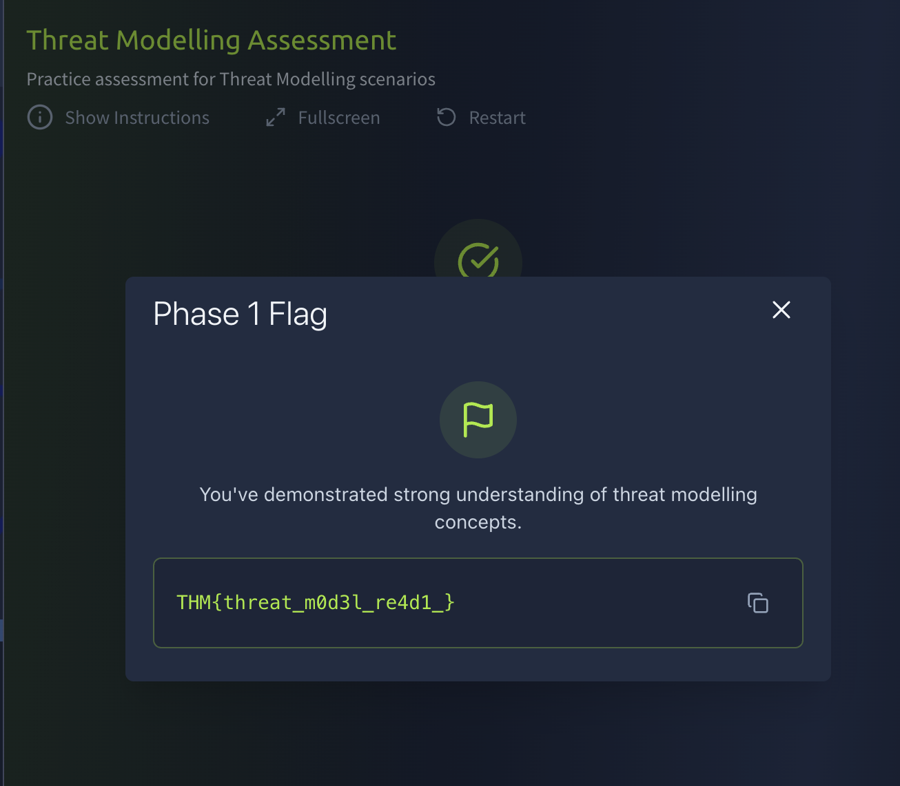
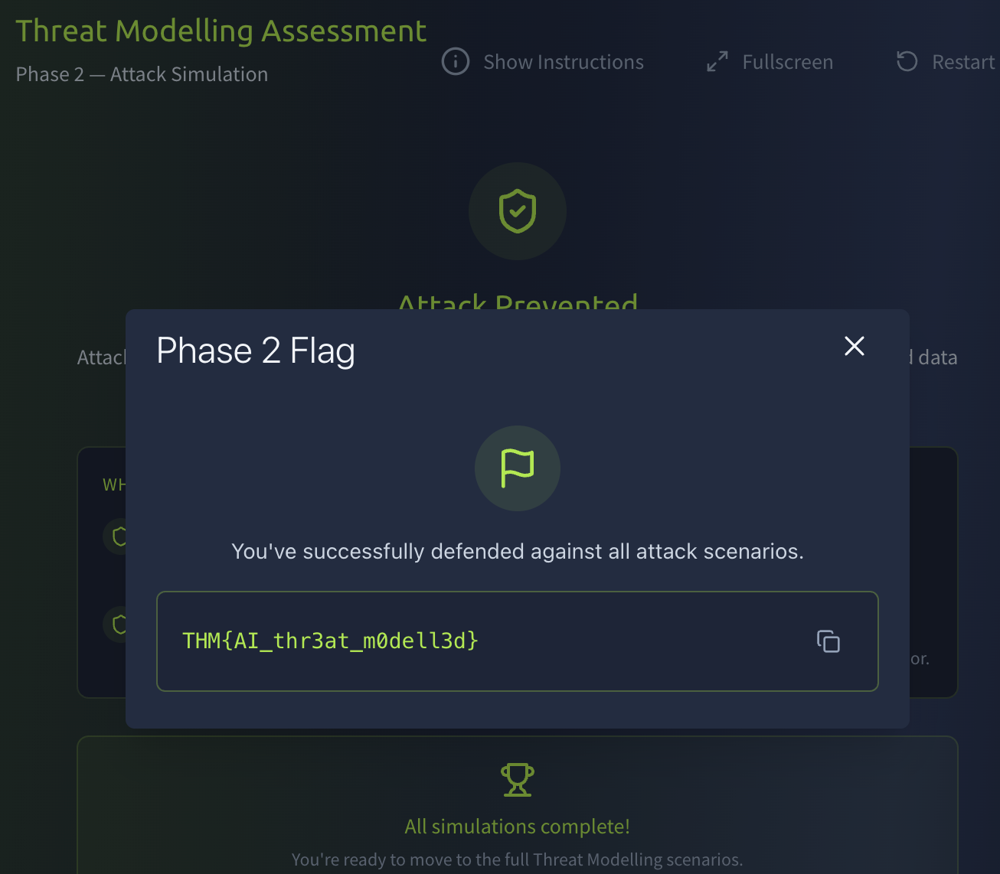

# AI Threat Modelling Assessment

# Task 1: Assessment

## Overview

This assessment combines concepts from previous modules covering:

- AI and Machine Learning fundamentals
- AI attack surfaces
- AI threat modelling
- Real-world AI vulnerabilities
- Security assessment methodologies

The objective is to apply both offensive and defensive AI security knowledge to identify vulnerabilities and retrieve flags from the target application.

---

## Objectives

- Analyze the AI-enabled application
- Identify exposed functionality and attack surfaces
- Apply AI threat modelling concepts
- Enumerate AI-related components and behaviors
- Exploit identified weaknesses to retrieve flags

---

## Exercise

---

### 1. What's the first flag?



```text
THM{threat_m0d3l_re4d1_}
```

---

### 2. What's the second flag?



```text
THM{AI_thr3at_m0dell3d}
```

---

##