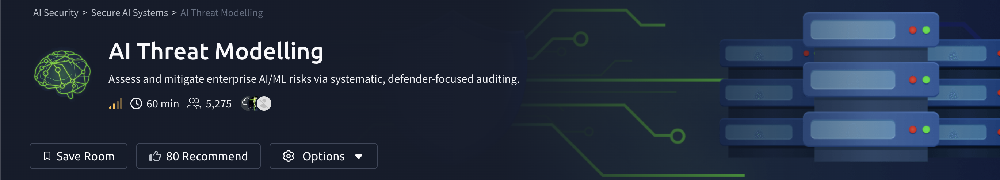
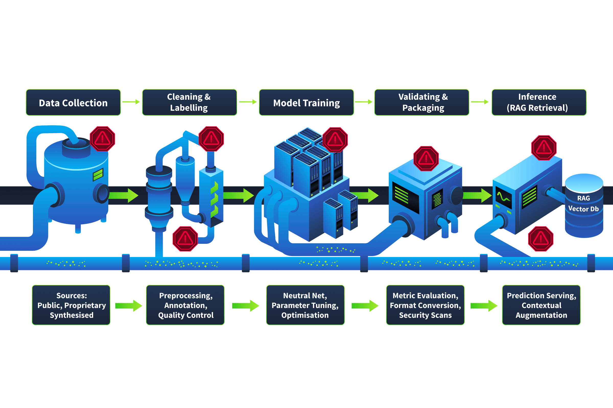
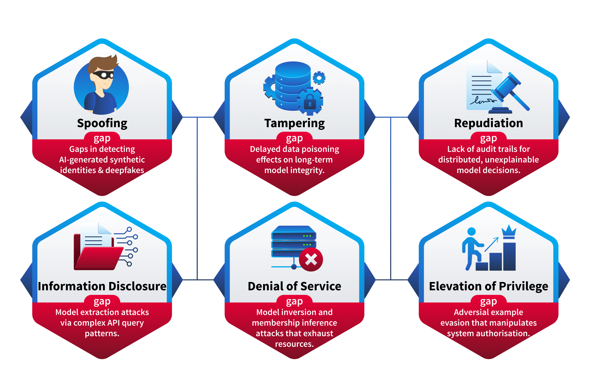
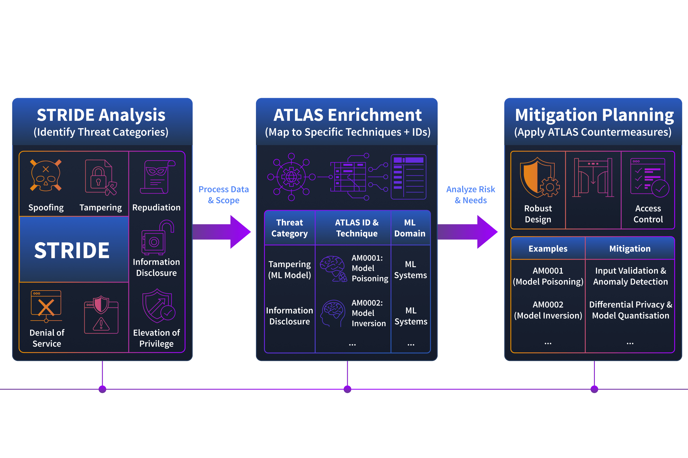
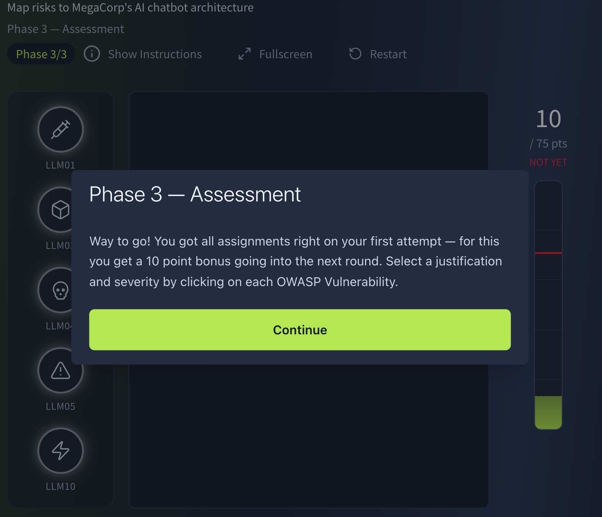
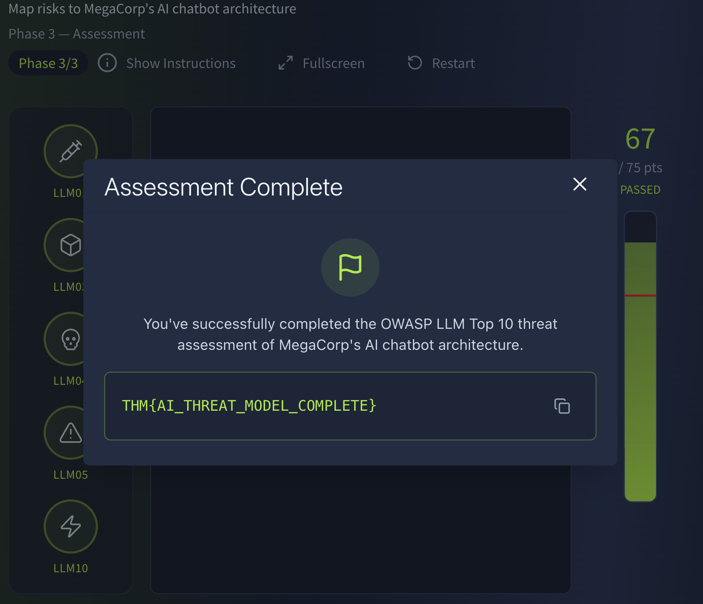

# AI Threat Modelling

# AI Threat Modelling



# Task 1 : Introduction

## Overview

AI is already integrated into enterprise environments through:

- Customer support chatbots
- Recommendation engines
- Fraud detection systems

These systems introduce new attack surfaces that traditional threat modelling frameworks were not designed to fully address.

---

## Key AI Security Risks

Traditional frameworks like STRIDE remain useful, but AI systems add unique threats such as:

- Training data poisoning
- Model theft
- Prompt injection
- Sensitive data leakage
- Non-deterministic model outputs

AI systems can behave differently for the same input, making threat analysis more complex than traditional applications.

---

## Learning Objectives

- Identify AI-specific assets and attack surfaces
- Apply STRIDE to AI/ML systems
- Use MITRE ATLAS for AI threat enumeration
- Map risks using OWASP LLM Top 10
- Produce structured AI threat assessments

---

## Prerequisites

- Basic Threat Modelling knowledge
- Familiarity with STRIDE
- Web Application Security fundamentals
- Introductory AI/ML security concepts

> This room is defender-focused and focuses on analysing/documenting AI threats rather than exploiting them.
> 

---

# Scenario - MegaCorp

You joined MegaCorp's security team as a Threat Analyst.

The company uses AI in multiple areas:

## AI Deployments

### Customer Chatbot

- LLM-powered chatbot
- Connected to internal knowledge bases through RAG

### Recommendation Engine

- Processes sensitive customer data
- Generates personalised product recommendations

### Fraud Detection System

- Performs real-time transaction authorization decisions

---

## Task Objective

The CISO wants a full AI threat assessment before the quarterly board meeting due to concerns about:

- AI manipulation
- Model/data theft
- Prompt injection
- Unpredictable AI behaviour

Your job is to assess MegaCorp's AI systems and identify potential security risks.

# Task 2 : AI-Specific Assets and Attack Surfaces

## Overview

Traditional applications focus on assets like:

- Databases
- API keys
- Source code
- Credentials
- Configuration files

AI systems introduce entirely new asset categories that require separate security considerations.

Missing these assets during threat modelling can expose major attack surfaces.

---

# AI-Specific Assets

| Asset | Description | Security Risk |
| --- | --- | --- |
| **Training Data** | Data used to train the model | Poisoned data can permanently alter model behaviour |
| **Model Weights / Parameters** | Numerical values representing learned behaviour | Theft gives attackers a full copy of the AI model |
| **Embedding Vectors** | Numerical representations used in RAG and recommendation systems | Manipulation affects retrieval accuracy and model decisions |
| **System Prompts** | Instructions controlling LLM behaviour and restrictions | Leakage exposes guardrails and internal logic |
| **Feature Stores** | Preprocessed data feeding live model inference | Tampering changes what the model sees during execution |
| **Model Registry / Artifacts** | Stored trained model versions for deployment | Attackers can replace legitimate models with malicious ones |

---

# Why AI Assets Matter

Unlike traditional systems:

- Stolen model weights cannot simply be "rotated" like passwords
- Poisoned training data may remain undetected until retraining
- Prompt leakage exposes internal controls and restrictions
- Manipulated embeddings can silently influence AI outputs

AI compromises often affect the model's behaviour itself rather than just stored data.

---

# AI System Characteristics

## Non-Deterministic Behaviour

AI models may generate different outputs for the same input.

This makes:

- Testing harder
- Incident reproduction difficult
- Security validation less predictable

---

## Black Box Problem

Deep learning models lack traditional code transparency.

Defenders often cannot trace:

- Internal reasoning
- Decision paths
- Exact output generation logic

Security analysis relies heavily on:

- Input/output testing
- Behaviour observation
- Failure mode analysis

# Exercise 2

## Q1

### In a RAG-based system, which AI asset type is used to retrieve relevant context at query time?

```
Embedding Vectors
```

---

## Q2

### An attacker gains access to MegaCorp's model registry and swaps the production model for a modified version. Which AI-specific asset has been compromised?

```
Model Registry / Artifacts
```

# Task 3 : Data Supply Chain and STRIDE's Gaps

## Overview

AI systems introduce a new attack surface through their data supply chain.

Unlike traditional software supply chains, AI models depend heavily on:

- Training data
- Model training pipelines
- Model registries
- Retrieval systems

Compromises in these stages can silently affect model behaviour long after deployment.

---

# AI Data Supply Chain


## Stage 1 - Data Collection

Training data may come from:

- Web scraping
- Internal databases
- Third-party providers
- User-generated content

### Risk

Attackers may inject malicious or manipulated data into datasets.

---

## Stage 2 - Cleaning and Labelling

Data is:

- Processed
- Filtered
- Labelled

### Risk

Poisoned or incorrect labels teach the model false patterns and behaviours.

---

## Stage 3 - Model Training

The model learns from prepared datasets.

### Risk

Malicious data becomes embedded into the model weights and may require retraining to remove.

---

## Stage 4 - Validation and Packaging

Models are:

- Evaluated
- Versioned
- Stored in model registries

### Risk

Attackers may replace legitimate models with backdoored versions.

Backdoors often bypass validation because trigger conditions are absent during testing.

---

## Stage 5 - Inference

The deployed model processes live queries.

LLM systems may also use:

- RAG pipelines
- Vector databases
- External retrieval systems

### Risk

Retrieved context can be manipulated to influence model outputs.

---

# Why AI Supply Chains Are Different

Traditional software compromises are usually:

- Easier to detect
- Faster to patch

AI poisoning attacks may:

- Remain hidden for weeks or months
- Gradually alter model behaviour
- Affect future retraining cycles

### Example

MegaCorp's fraud detection model retrains monthly.

An attacker slowly injecting crafted fraudulent transactions could shift the model's decision boundaries until fraudulent activity is no longer detected.

---

# Why STRIDE Alone Falls Short

STRIDE still works for AI threat modelling, but it requires adaptation.



---

## STRIDE Gaps in AI Systems

### Training Data Poisoning

- Falls under **Tampering**
- Effects are delayed and difficult to identify

---

### Adversarial Inputs

Attackers can craft prompts or inputs that:

- Cause hallucinations
- Trigger unsafe behaviour
- Bypass safeguards

These attacks overlap multiple STRIDE categories.

---

### Expanded Privileges

Modern AI systems may:

- Execute code
- Access databases
- Browse the web
- Send emails

Compromising the model may grant access to connected tools and permissions.

---

### Model Theft

Extracting model weights is classified as:

- **Information Disclosure**

However, the attacker gains a full copy of the organisation's trained AI capability.

---

# Key Takeaway

STRIDE remains useful for AI security assessments, but defenders must extend it to address:

- AI-specific assets
- Data poisoning
- Adversarial manipulation
- Model theft
- AI tool access and automation

# Exercise 3

## Q1

### An attacker injects crafted data points into a training pipeline over several months, gradually shifting the model's decision boundaries. At which supply chain stage does the attacker inject the malicious data?

```
Data Collection
```

---

## Q2

### Which STRIDE category is insufficient for capturing the delayed, diffuse effects of training data poisoning?

```
Tampering
```

# Task 4 : Adapting STRIDE for AI Systems

## Overview

Traditional STRIDE threat modelling still applies to AI systems, but each category manifests differently due to:

- AI training pipelines
- Model behaviour
- RAG architectures
- Tool-enabled LLMs
- Non-deterministic outputs

The goal is not to replace STRIDE, but to adapt it for AI environments.

---

# STRIDE Refresher

| Category | Security Property | Traditional Meaning |
| --- | --- | --- |
| **S — Spoofing** | Authenticity | Pretending to be another user/service |
| **T — Tampering** | Integrity | Modifying data or systems |
| **R — Repudiation** | Non-repudiation | Denying performed actions |
| **I — Information Disclosure** | Confidentiality | Exposing sensitive information |
| **D — Denial of Service** | Availability | Making systems unavailable |
| **E — Elevation of Privilege** | Authorization | Gaining unauthorized capabilities |

---

# STRIDE Adapted for AI

## 1. Spoofing → Data Source Impersonation

### AI Manifestation

Attackers inject malicious content into:

- RAG knowledge bases
- Vector databases
- External document sources

The AI treats attacker-controlled data as legitimate context.

### Other AI Spoofing Threats

- Model impersonation
- Adversarial identity attacks

### MegaCorp Example

Fake policy documents are injected into the chatbot's knowledge base, causing incorrect responses.

---

## 2. Tampering → Data Poisoning

### AI Manifestation

Attackers manipulate training data to alter model behaviour.

Effects appear later during inference rather than immediately.

### Other AI Tampering Threats

- Model manipulation
- Prompt injection
- Feature tampering

### MegaCorp Example

Crafted fraudulent transactions slowly retrain the fraud model to ignore malicious patterns.

### MITRE ATLAS

- `AML.T0020 — Data Poisoning`
- `AML.T0018 — Backdoor ML Model`

---

## 3. Repudiation → Lack of Decision Audit Trails

### AI Manifestation

AI systems often cannot fully explain:

- Why a decision was made
- Which model version responded
- What context influenced the output

### Other AI Repudiation Issues

- Context volatility
- Missing model deployment logs

### MegaCorp Example

The security team cannot determine why the fraud system approved a suspicious transaction weeks earlier.

---

## 4. Information Disclosure → Model Extraction

### AI Manifestation

Attackers query APIs repeatedly to reconstruct a functional copy of the model.

### Other AI Disclosure Threats

- Training data extraction
- System prompt leakage
- Embedding inversion

### MegaCorp Example

A competitor rebuilds MegaCorp's recommendation engine using API responses and confidence scores.

### MITRE ATLAS

- `AML.T0024 — Extract ML Model`
- `AML.T0025 — Infer Training Data Membership`

---

## 5. Denial of Service → Inference Cost Exploitation

### AI Manifestation

Attackers abuse expensive AI inference requests to increase operational costs.

Also called:

- **Denial of Wallet**

### Other AI DoS Threats

- GPU exhaustion
- Sponge examples
- Training pipeline disruption

### MegaCorp Example

Thousands of crafted chatbot prompts massively increase cloud inference costs without taking the system offline.

### OWASP LLM Top 10

- `LLM10:2025 — Unbounded Consumption`

---

## 6. Elevation of Privilege → Jailbreaking

### AI Manifestation

Attackers bypass model safeguards and restrictions using crafted prompts.

### Other AI Privilege Escalation Threats

- Excessive agency
- Tool exploitation
- Cross-plugin escalation

### MegaCorp Example

A jailbroken chatbot abuses connected database tools to extract customer PII.

### OWASP LLM Top 10

- `LLM06:2025 — Excessive Agency`

---

# What STRIDE Still Misses

## Adversarial Examples

Inputs designed to:

- Cause misclassification
- Trigger unsafe behaviour
- Bypass controls

These attacks span multiple STRIDE categories simultaneously.

---

## Model Bias and Fairness

Bias-related failures:

- Have compliance implications
- Affect trust and security
- Do not map cleanly to STRIDE

---

## Emergent Behaviour

Large models may develop:

- Unexpected capabilities
- Unpredictable behaviours

These risks are difficult to model using traditional frameworks.

---

# Key Takeaway

STRIDE remains valuable for AI threat modelling, but defenders must adapt it for:

- AI pipelines
- RAG systems
- Prompt injection
- Model extraction
- Tool-enabled AI systems
- Non-deterministic behaviour

Additional frameworks like MITRE ATLAS are needed to fully cover AI-specific threats.

# Exercise 4

## Q1

### What is the primary AI-specific manifestation of Information Disclosure in the STRIDE-AI mapping?

```
Model Extraction
```

---

## Q2

### An attacker crafts prompts that cause an LLM to bypass its safety guidelines and content restrictions. Which STRIDE category does this map to?

```
Elevation of Privilege
```

---

## Q3

### Which OWASP LLM Top 10 (2025) entry addresses the risks of AI systems being granted too many permissions or too much autonomy?

```
LLM06:2025 — Excessive Agency
```

---

## Q4

### An attacker drives your monthly inference bill from $15,000 to $180,000 without taking your service offline. What is this type of attack commonly called?

```
Denial of Wallet
```

# Task 5 : MITRE ATLAS - The AI Threat Technique Catalogue

## Overview

MITRE ATLAS (Adversarial Threat Landscape for Artificial-Intelligence Systems) is a framework for identifying and analysing attacks against AI and ML systems.

It works similarly to:

- MITRE ATT&CK for traditional systems
- But focuses specifically on AI threats

ATLAS helps defenders understand:

- AI attack techniques
- Adversary behaviour
- Defensive mitigations
- Real-world AI attack scenarios

---

# What MITRE ATLAS Provides

As of early 2026, ATLAS contains:

- 16 tactics
- 155 techniques
- 35 mitigations
- 52 real-world case studies

> Always check the official MITRE ATLAS site for updated numbers.
> 

---

# ATLAS Structure

| Component | Purpose | Example |
| --- | --- | --- |
| **Tactic** | Why the attacker acts | `ML Attack Staging (AML.TA0012)` |
| **Technique** | How the attack is performed | `Data Poisoning (AML.T0020)` |
| **Sub-technique** | Specific attack variation | `Craft Adversarial Data (AML.T0043.004)` |
| **Mitigation** | Defensive countermeasure | Input validation, provenance tracking |

---

# Important ATLAS Techniques

## Data Poisoning — `AML.T0020`

### Description

Injecting malicious data into training pipelines to alter model behaviour.

### STRIDE Mapping

- **Tampering**

### Impact

- Corrupts future model behaviour
- Effects remain until retraining occurs

---

## Model Extraction — `AML.T0024`

### Description

Attackers repeatedly query APIs to reconstruct a functional copy of the model.

### STRIDE Mapping

- **Information Disclosure**

### Impact

- Intellectual property theft
- Offline adversarial testing

---

## Evade ML Model — `AML.T0015`

### Description

Crafting adversarial inputs to bypass model detection or classification.

### STRIDE Mapping

- Tampering
- Spoofing
- Elevation of Privilege

### Example

- Bypassing malware detection
- Avoiding content moderation

---

## LLM Prompt Injection — `AML.T0051`

### Description

Manipulating model behaviour through malicious prompts.

### Types

- **Direct Injection** → User-crafted prompts
- **Indirect Injection** → Malicious instructions embedded in retrieved content

### STRIDE Mapping

- **Tampering**

### MegaCorp Risk

Indirect prompt injection through the RAG knowledge base.

---

## Backdoor ML Model — `AML.T0018`

### Description

Embedding hidden malicious triggers during model training.

### Behaviour

- Model behaves normally during testing
- Trigger activates malicious behaviour later

### Similar To

- Logic bombs inside neural networks

---

# Using ATLAS with STRIDE


## Recommended Workflow

### 1. Start With STRIDE

Identify:

- What can go wrong
- Which security property is affected

---

### 2. Enrich With ATLAS

Map identified risks to:

- AI-specific attack techniques
- Real-world attack methods
- Known adversary behaviour

---

### 3. Apply Mitigations

Use ATLAS defensive guidance such as:

- Data provenance tracking
- Input validation
- Drift monitoring
- Anomaly detection

---

# MegaCorp Example

### STRIDE Finding

Fraud detection training pipeline vulnerable to:

- **Tampering**

### ATLAS Technique

- `AML.T0020 — Data Poisoning`

### Recommended Mitigations

- Training data provenance validation
- Anomaly detection on inputs
- Model drift monitoring

This converts a generic threat into a detailed, actionable security finding.

---

# Real-World ATLAS Case Studies

## ShadowRay — `AML.CS0023`

### Description

Attackers exploited vulnerabilities in the Ray AI framework to compromise AI training infrastructure.

### Importance

Demonstrated that AI supply chain attacks are actively occurring in production environments.

---

## Morris II Worm — `AML.CS0024`

### Description

A self-replicating prompt injection worm targeting AI agents using RAG-based systems.

### Capabilities

- Injected malicious prompts automatically
- Extracted PII
- Spread between AI agents

### Importance

Showed how prompt injection can propagate autonomously across AI systems.

---

# Key Takeaway

MITRE ATLAS complements STRIDE by providing:

- AI-specific attack techniques
- Real-world AI attack examples
- Structured defensive mitigations
- Practical AI threat intelligence

STRIDE identifies the category of risk, while ATLAS explains how the attack works in practice.

# Exercise 5

## Q1

### What does the acronym ATLAS stand for?

```
Adversarial Threat Landscape for Artificial-Intelligence Systems
```

---

## Q2

### Which ATLAS case study described a self-replicating prompt injection worm that spread between AI agents via RAG email systems?

```
Morris II
```

---

## Q3

### What is the ATLAS technique ID for Model Extraction?

```
AML.T0024
```

# Task 6 : OWASP LLM Top 10 - Mapping Risks to Components

## Overview

The OWASP Top 10 for LLM Applications (2025) identifies the most critical security risks affecting LLM deployments.

Unlike a simple checklist, it helps defenders:

- Map risks to architecture components
- Identify exposed systems quickly
- Prioritize hardening efforts

---

# OWASP LLM Top 10 (2025)

| ID | Risk | Description | Vulnerable Components |
| --- | --- | --- | --- |
| **LLM01** | Prompt Injection | Manipulating model behaviour using crafted prompts | Inference endpoint, RAG pipeline, vector database |
| **LLM02** | Sensitive Information Disclosure | Leakage of PII, credentials, or proprietary data | Training pipeline, system prompts, inference endpoint |
| **LLM03** | Supply Chain | Compromised models, datasets, plugins, or dependencies | Training pipeline, model registry, third-party integrations |
| **LLM04** | Data and Model Poisoning | Manipulated training data or model weights | Training pipeline, feature store, model registry |
| **LLM05** | Improper Output Handling | Unsafe handling of model outputs | Web frontend, API gateway, downstream systems |
| **LLM06** | Excessive Agency | Overly permissive AI tools or permissions | Tool integrations, inference endpoint, orchestration layers |
| **LLM07** | System Prompt Leakage | Exposure of hidden prompts or internal logic | System prompts, inference endpoint |
| **LLM08** | Vector and Embedding Weaknesses | Attacks against embeddings and RAG systems | Vector databases, embedding systems, RAG pipelines |
| **LLM09** | Misinformation | Hallucinated or incorrect outputs | Inference endpoint, vector databases |
| **LLM10** | Unbounded Consumption | Resource exhaustion or denial of wallet | API gateway, inference endpoint, training pipeline |

---

# Reading the Framework

## Risk → Component

Example:

### Prompt Injection

Impacts:

- Inference endpoints
- RAG pipelines
- Vector databases

These components require:

- Input validation
- Prompt boundary controls
- Content filtering

---

## Component → Risk

Example:

### Vector Database

Associated risks:

- `LLM01 — Prompt Injection`
- `LLM08 — Embedding Weaknesses`
- `LLM09 — Misinformation`

This defines the security scope for that component.

---

# Component Risk Profiles

## LLM Inference Endpoint

Highest concentration of risks:

- Prompt Injection
- Sensitive Information Disclosure
- Improper Output Handling
- Excessive Agency
- System Prompt Leakage
- Misinformation
- Unbounded Consumption

### Priority

Requires the strongest hardening and monitoring.

---

## Vector Database / RAG Pipeline

Primary risks:

- Indirect prompt injection
- Embedding attacks
- Retrieval manipulation
- Stale or incorrect source data

### Security Focus

- Access control
- Input validation
- Source freshness monitoring

---

## Training Pipeline

Primary risks:

- Supply chain compromise
- Data poisoning
- Sensitive data exposure

### Security Focus

- Dataset provenance
- Model verification
- Fine-tuning integrity checks

---

# Relationship Between STRIDE, ATLAS, and OWASP

| Framework | Purpose | Usage |
| --- | --- | --- |
| **STRIDE-AI** | Categorises threats | Identify what could go wrong |
| **MITRE ATLAS** | Documents attack techniques | Understand how attacks work |
| **OWASP LLM Top 10** | Maps risks to components | Prioritise security controls |

---

# Key Takeaway

The OWASP LLM Top 10 helps defenders:

- Identify vulnerable AI components
- Prioritise hardening efforts
- Understand where AI risks exist in architecture

Combined with:

- STRIDE for threat categories
- MITRE ATLAS for attack techniques

It provides a complete AI threat modelling workflow.

# Exercise 6

## Q1

### How many of the OWASP LLM Top 10 entries affect the LLM Inference Endpoint?

```
7
```

---

## Q2

### An organisation notices their chatbot is rendering LLM output directly in the browser without sanitisation. Which OWASP entry does this fall under?

```
Improper Output Handling
```

---

## Q3

### Which component in a typical LLM architecture is the primary one that needs hardening against data and model supply chain risks (LLM03)?

```
Training Pipeline
```

# Final Task : AI Threat Modelling Exercise

## Overview

Completed the interactive AI Threat Modelling exercise by:

- Identifying OWASP LLM Top 10 vulnerabilities
- Mapping risks to architecture components
- Applying STRIDE-AI concepts
- Using MITRE ATLAS techniques for threat analysis

Successfully analysed AI deployment risks and validated threat modelling decisions through the practical exercise.

> Screenshots of the completed exercise and solutions have been added to the GitHub repository.
> 

---

# Flag

```
THM{AI_THREAT_MODEL_COMPLETE}
```





# Conclusion:

## Overview

This room covered a complete AI threat modelling workflow focused on identifying, analysing, and documenting risks in modern AI systems.

Throughout the room, we explored how traditional security concepts evolve when applied to AI and LLM-based architectures.

---

# What Was Covered

## AI-Specific Assets

Identified new AI attack surfaces including:

- Training data
- Model weights
- Embedding vectors
- System prompts
- Feature stores
- Model registries

---

## AI Data Supply Chain

Mapped how AI systems move from:

- Data collection
- Data cleaning and labelling
- Model training
- Validation and packaging
- Production inference

And analysed how each stage can be compromised.

---

## STRIDE for AI Systems

Adapted traditional STRIDE categories for AI threats such as:

- Data poisoning
- Prompt injection
- Model extraction
- Jailbreaking
- Excessive agency
- Denial of wallet

---

## MITRE ATLAS

Used MITRE ATLAS to:

- Map AI attack techniques
- Understand adversary behaviour
- Reference real-world AI attacks
- Apply AI-specific mitigations

---

## OWASP LLM Top 10

Mapped security risks directly to architecture components including:

- Inference endpoints
- RAG pipelines
- Vector databases
- Training pipelines
- Tool integrations

This provided a practical method for prioritising AI security risks.

---

## Practical Threat Assessment

Applied all frameworks to MegaCorp's AI deployments:

- Customer chatbot
- Recommendation engine
- Fraud detection system

Performed:

- Threat identification
- Risk mapping
- Component analysis
- Security prioritisation

---

# Key Takeaways

- AI systems introduce entirely new assets and attack surfaces
- Traditional threat modelling frameworks still apply but require adaptation
- STRIDE identifies threat categories
- MITRE ATLAS provides AI-specific attack techniques
- OWASP LLM Top 10 maps risks directly to vulnerable components
- AI security assessments must consider both models and their surrounding infrastructure

---

# Final Thoughts

AI systems are not simply traditional applications with machine learning added on top. They introduce:

- New supply chain risks
- Non-deterministic behaviour
- Expanded privilege boundaries
- Prompt-driven attack surfaces
- Model-centric security concerns

Understanding these risks is essential for building secure AI deployments.

---

# Additional Resources

- MITRE ATLAS
- OWASP AI Exchange
- OWASP LLM Top 10
- MITRE ATT&CK

---